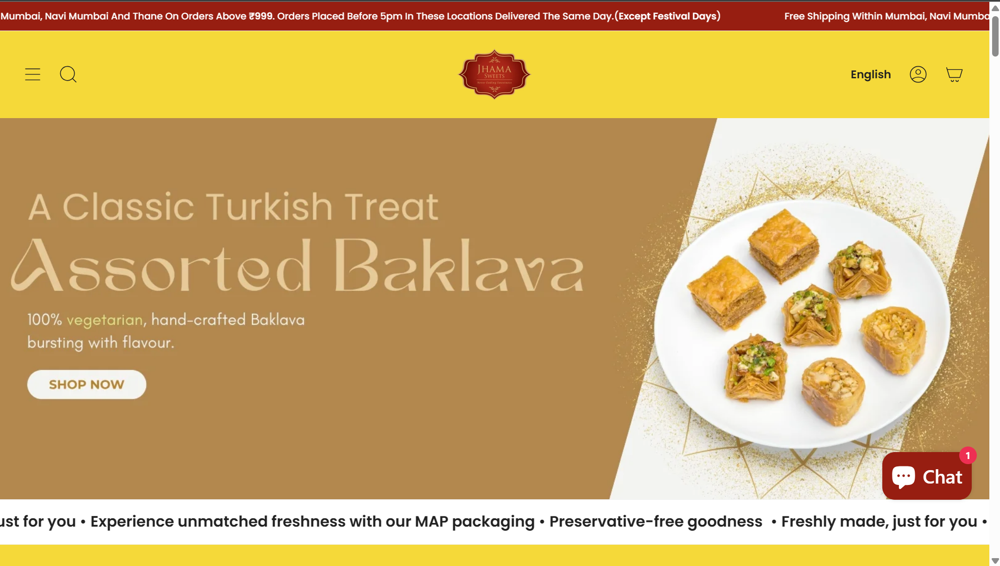
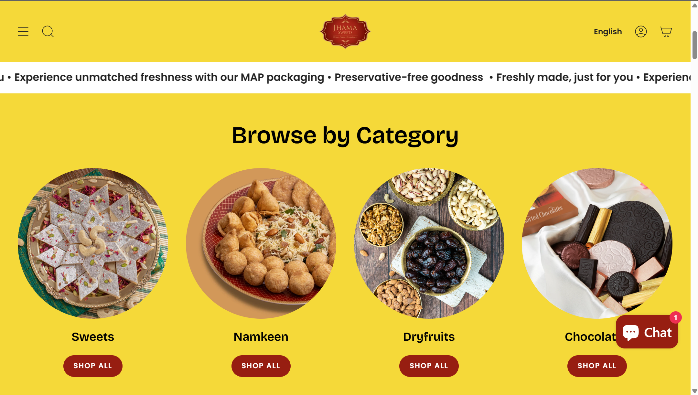
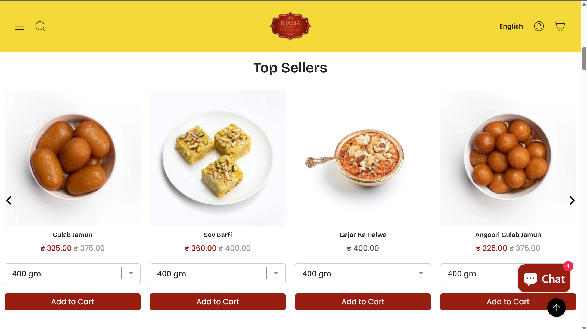
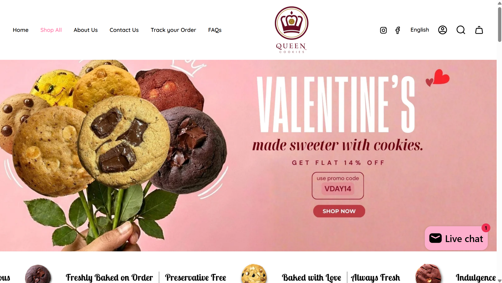
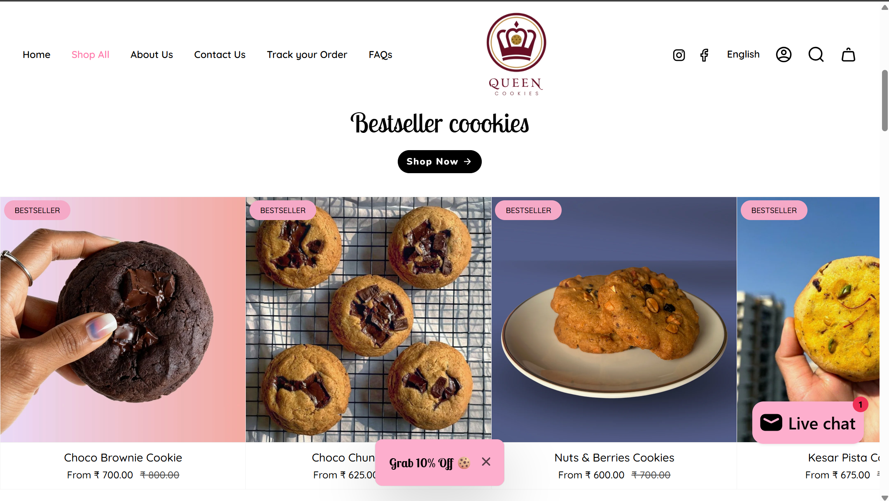
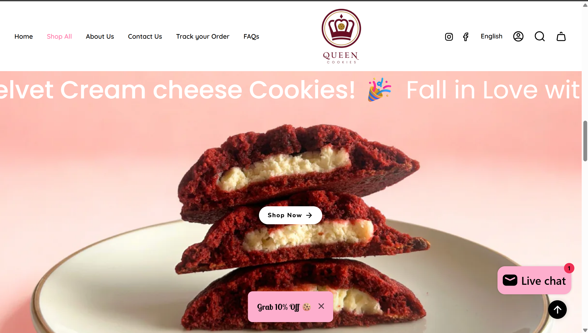

<!-- 🔥 HERO HEADER -->

 

<!-- SLOGAN TYPING -->

  

---

# 💎 PREMIUM SERVICES

| 🚀 Website Creation | 🛠 Maintenance | 🏗 Renovation | 📱 Apps |
|--------------------|---------------|--------------|--------|
| High-speed builds | Zero downtime | Legacy → Modern | iOS & Android |

| 🤖 AI Agents | 💬 Chatbots | 🎮 Game Dev | 🖥 Desktop Apps |
|-------------|------------|------------|---------------|
| Automation Systems | Smart Support | Unity / Unreal | Enterprise Software |

---

# 🏆 PORTFOLIO SHOWCASE
### *Crafting Digital Success Stories*

 

## 🍬 Jhama Sweets – Mumbai

> **Scope:** Full E-commerce Overhaul • Inventory Automation • Premium UI/UX

<a href="https://jhamasweets.com">
<table>
<tr>
<td></td>
<td></td>
</tr>
<tr>
<td></td>
<td></td>
</tr>
</table>
</a>

 

---

## 🍪 Queen Cookies – Mumbai

> **Scope:** Brand Revitalization • Animation-driven UI • Seamless Checkout

<a href="https://queencookies.in">
<table>
<tr>
<td></td>
<td></td>
</tr>
<tr>
<td></td>
<td></td>
</tr>
</table>
</a>

 

 

---

# ⚡ TECH ARSENAL

 

---

# 📞 READY TO SCALE YOUR BUSINESS?

 

<b>📍 Indore, India | 🌍 Serving Clients Globally</b> 
<i>Engineering Scalable Digital Systems Since 2020</i>

